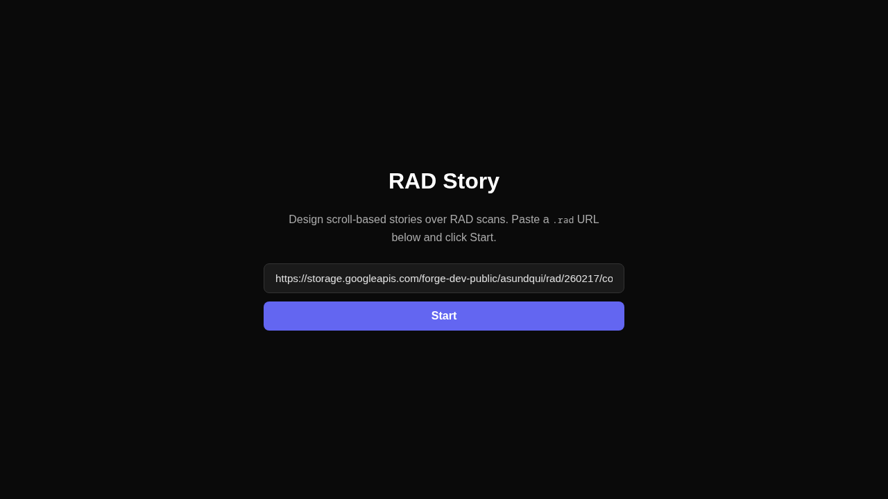
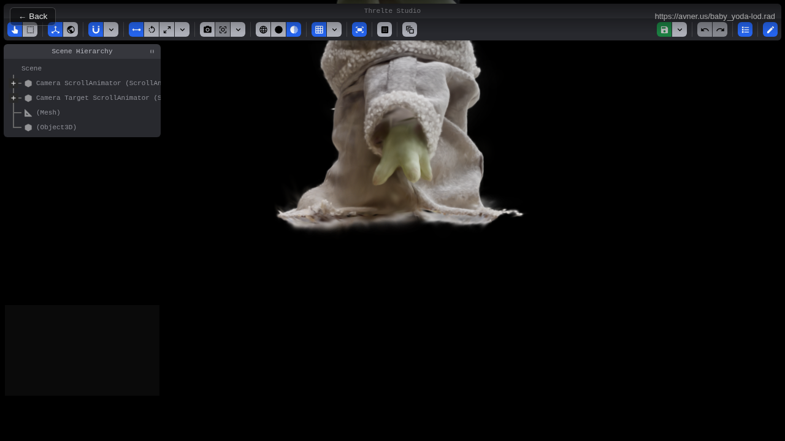
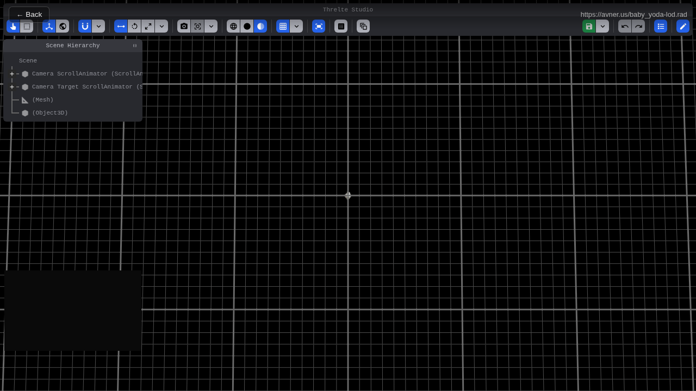
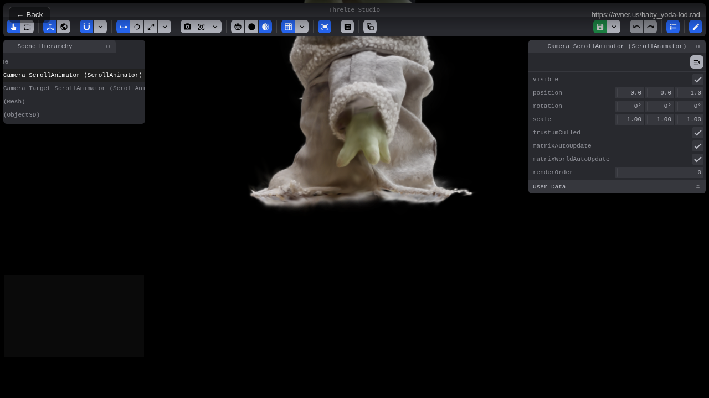
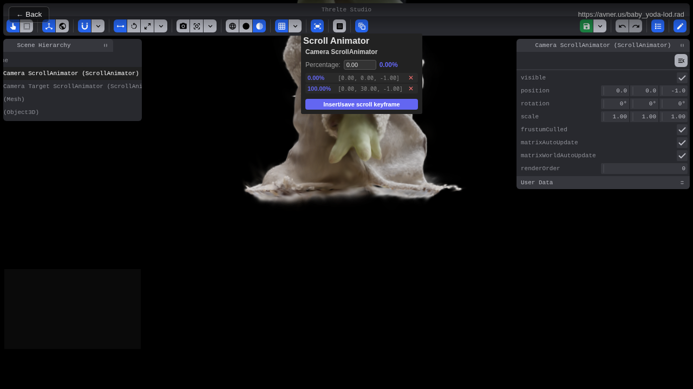
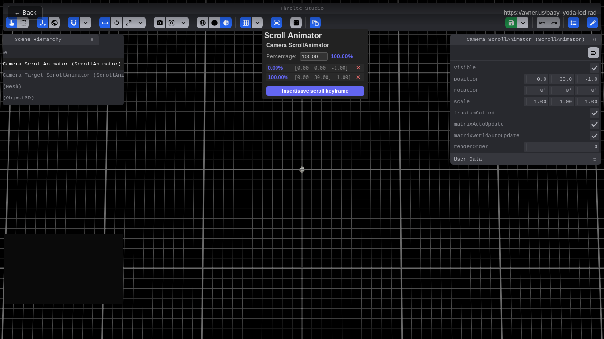
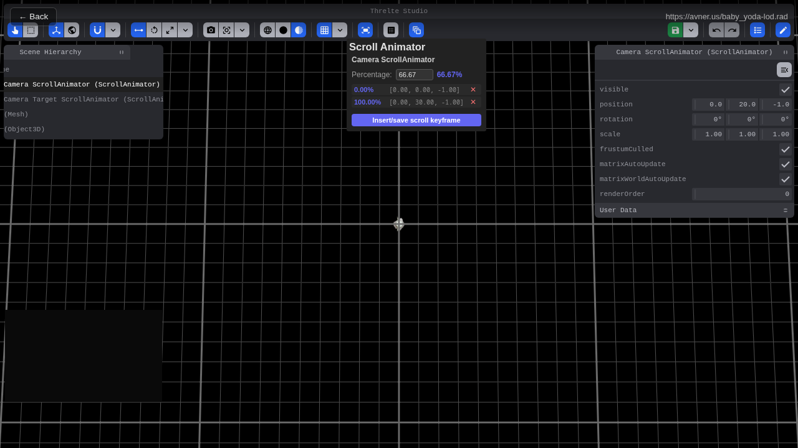

# RAD Story

A web-based tool for **designing scroll-based stories over Spark 2.x streaming LOD Gaussian splats** from user-provided RAD file URLs. Built with [Svelte 5](https://svelte.dev/), [Threlte](https://threlte.xyz/), [Three.js](https://threejs.org/), and [GSAP ScrollTrigger](https://gsap.com/docs/v3/Plugins/ScrollTrigger/).

## Features

- Landing screen with RAD URL input and start button
- Full-viewport Threlte-powered Spark viewer with Threlte Studio integration
- Scroll-driven camera animation: keyframe camera poses along a scroll axis using the Scroll Animator panel
- Mobile-aware performance settings (DPR clamping, reduced splat budgets, foveation)
- RAD URL validation with user-friendly error messages
- URL preserved in query string for reloadability

## Sample RAD URL

```
https://storage.googleapis.com/forge-dev-public/asundqui/rad/260217/cozy-spaceship_2-lod.rad
```

This URL is pre-filled in the input field for convenience.

For quick testing and authoring, a lightweight Baby Yoda scan loads quickly and avoids GPU stalls:

```
https://avner.us/baby_yoda-lod.rad
```

## Installation & Development

```bash
npm install        # Install dependencies
npm run dev        # Start dev server
npm run build      # Production build
npm run preview    # Preview production build
```

## Quality Checks

```bash
npm run check      # TypeScript + Svelte type checking
npm run lint       # ESLint
npm run test:unit  # Vitest unit tests
npm run test:e2e   # Playwright e2e tests
npm run test       # All tests
```

## How to Use

1. Open the app in a browser.
2. Paste a `.rad` file URL (or use the pre-filled sample).
3. Click **Start**.
4. The viewer loads the splat data via Spark's streaming LOD system.



5. Once loaded, the Threlte Studio editor appears with a scene hierarchy and toolbar.



6. **Scroll** to animate the camera along your authored keyframes.



## Creating Scroll Animations

Scroll animations are authored using two `ScrollAnimator` objects in the scene hierarchy:

- **Camera ScrollAnimator** — controls the camera position at each scroll percentage
- **Camera Target ScrollAnimator** — controls what the camera looks at at each scroll percentage

The camera always looks at the CameraTarget's world position (look-at constraint), so the Camera ScrollAnimator's rotation does not fight the target — it only controls position.

### Step 1: Open the Scroll Animator Panel

Click the **Scroll Animator** button (🎞️ icon) on the Studio toolbar to open the Scroll Animator panel. Initially it shows "Select one ScrollAnimator".

### Step 2: Select a ScrollAnimator

In the **Scene Hierarchy** panel (left side), click on either `Camera ScrollAnimator` or `Camera Target ScrollAnimator`. The Scroll Animator panel updates to show the selected animator's name, current scroll percentage, and existing keyframes.



### Step 3: Position the Camera

Use the Studio toolbar tools to position the animator:

- **Move tool** (↔️ icon) — drag the gizmo arrows to reposition the animator in 3D space
- **Rotate tool** (↻ icon) — rotate the animator
- **Scale tool** (⤡ icon) — scale the animator


You can also select the **Camera Target ScrollAnimator** and position it where you want the camera to look:



### Step 4: Insert a Keyframe

Once the animator is positioned where you want it, click **Insert/save scroll keyframe** in the Scroll Animator panel. This captures the current local position and Euler rotation at the current scroll percentage.

### Step 5: Repeat at Different Scroll Positions

1. **Scroll** the page to a new position (or type a percentage in the panel's Percentage input)
2. Reposition the camera or target using the Move/Rotate tools
3. Click **Insert/save scroll keyframe** again

The panel shows all keyframes sorted by percentage. Click any percentage to **jump** to that scroll position.



### Step 6: Preview the Animation

Scroll the page to preview the camera animation. GSAP ScrollTrigger interpolates between keyframes:

- **Position** interpolates linearly (lerp)
- **Rotation** uses shortest-path quaternion slerp



### Managing Keyframes

- **Jump**: Click any keyframe's percentage to jump to that scroll position
- **Delete**: Click the ✕ button next to a keyframe to remove it
- **Edit**: Scroll to the keyframe's percentage, reposition the animator, then click **Insert/save scroll keyframe** to update it (upsert)

### Tips

- Author keyframes for **both** the Camera ScrollAnimator and Camera Target ScrollAnimator to get full control over camera position and look direction
- Use the **Grid** button (⊞ icon) on the toolbar to toggle the ground grid for spatial reference
- Use the **Editor Camera** toggle if you need to navigate the scene freely while authoring — the app camera resumes when toggled off
- Keyframes are persisted via Threlte Studio's source sync — they survive page reloads during development

## Providing a RAD URL

The app accepts:
- Full `http://` or `https://` URLs
- Same-origin relative paths (e.g., `/assets/model.rad`)

The file must have a `.rad` extension. Query strings and hash fragments are allowed.

## CORS

Remote RAD files and their `.radc` chunk files must be served with [CORS](https://developer.mozilla.org/en-US/docs/Web/HTTP/CORS) headers. If a URL fails to load, verify that the server allows cross-origin requests from your domain.

## Mobile Performance

On mobile/iOS devices, the app automatically applies conservative settings:
- Device pixel ratio clamped to 1
- Reduced splat scale and higher render scale
- Lower `maxStdDev` and `maxPagedSplats`
- Stronger foveation culling

These settings are controlled by Spark's LOD system and renderer options.

## Architecture

- **Svelte 5** with runes (`$state`, `$effect`, `$props`)
- **Threlte** `<Canvas>` with custom `createRenderer` for Spark compatibility
- **Spark 2.x** `SparkRenderer` + `SplatMesh` with `paged: true` for RAD streaming
- **GSAP ScrollTrigger** for scroll-driven camera animation
- **Vitest** for unit tests, **Playwright** for e2e tests

## Tech Stack

| Package | Purpose |
|---------|---------|
| `svelte@5` | UI framework with runes |
| `@threlte/core` | Three.js integration for Svelte |
| `@threlte/studio` | 3D scene editor with source sync |
| `@sparkjsdev/spark` | Gaussian splat rendering with streaming LOD |
| `three` | 3D graphics |
| `gsap` | ScrollTrigger camera animation |
| `vite` | Build tool and dev server |
| `vitest` | Unit testing |
| `@playwright/test` | End-to-end testing |
